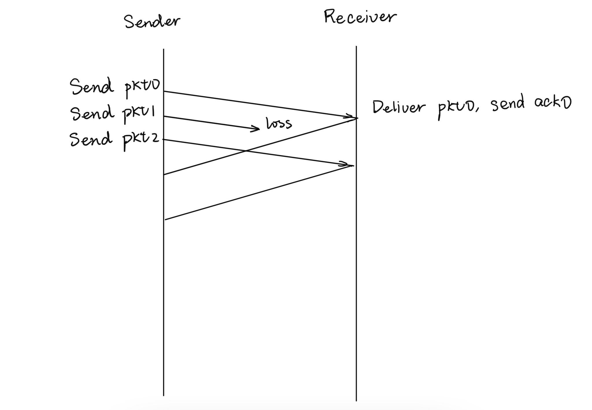

# 仅供交流学习 下载后请在24小时后删除 
# 侵删 
# EDWARD_GW 整理   01:13AM Nov 8th（白给） 

*ORIGAMI_LS 校验   11:23AM Nov 9th（难顶）*

考试科目：计算机网络

学生所在系______姓名:

一、单选题(10 分，每题2 分)。

1.分组在交换网络中需要经历各种延迟，以下哪种延迟对分组的端到端延迟贡献最大()

(A)传输延迟
(B)传播延迟
(C)排队延迟
(D)不好说

2.以下哪种设备上运行了完整的协议栈()

(A)終端
(B)路由器
(C)交换机
(D)以上都是

3.协议是以下哪两个实体之间通信时需要遵循的规则()

(A)同一个系统的相邻层实体之间
(B)不同系统的相同层实体之间。
(C)不同系统的不同层实体之间
(D)以上都是。

4.以下关于电子邮件系统的说法，哪一个是正确的()

(A)用户信箱是邮件服务器中的一块内存区域
(B)发信人的用户代理将邮件发送到收信人的邮件服务器
(C)收信人的邮件服务器将邮件推送给收信人的用戶代理。
(D)邮件报文在邮件服务器之回逐跳转发。

5.以下哪个协议不能用于访问用户邮箱()

(A) HTTP
(B) POP3
(C) SMTP
(D) IMAP

6.以下有关 DNS 的说法，哪一个是正确的()

(A)因特网上的每台主机都需要一个域名
(B)一个域名惟一映射到一个 IP 地址
(C)本地域名服务器不属于域名服务器层次
(D)域名解析每次都要从查询根域名服务器开始

7.以下关于 DNS 的说法，哪一个是错误的

(A)DNS请求报文总是使用UDP传输
(B)DNS响应报文可以使用UDP或TCP传输
(C)当DNS响应报文需要可靠传输时使用TCP
(B)当DNS 响应报文太大时使用 TCP

8.传输层最基本的功能是

(A)可靠传输
(B)实现进程-进程通信
(C)流量控制
(D)拥塞控制

9.主机 A 向主机 B发送了一个 TCP 段，半号为 90，包含 100 个字节的数据。主机 B 正确收到后发送一个TCP 段进行确认。以下关于该 TCP 段中的确认序号，哪一个说法是正确的()

(A)必定是91
(B)必定是 190
(C)可能小于90
(D)不可能大于190

10.套接字(Locket)提供的通信服务是

(A)主机到主机
(B)主机到进程
(C)进程到主机
(D)进程到进程

二、简答题(50 分，共 6 题)

1.(10 分)设有一个采用 Go-backn 的数据传输过程:发送方有 4 个分组(phtD~pkt3)要发送,发送窗口大小为 3，pkt1 在发送过程中丢失，其余分组都没有丢失。在下面的时间线图中，仿照示例，补充完整个分组的发送和接收过程

2.(10 分)一个基于重传的可靠协议通常包含以下要素：差错编码、确认、重传、定时器、分组序号。请解释为什么需要这些要素。

3.(5 分)通信网絡中转发数据有两种基本的方法：电路交換和分组交换。
(1)说明电路交换和分组交换有哪些不同？(至少说出2点)
(2)为什么 Internet 选择使用分组交换而不是电路交换？

4.(5 分)主机 A 向主机 B 发起一个 TCP 连接，假设主机 A和主机B选择的起始序号分别为在9和38，将下表中三次握手交换的报文段的相关信息填充完整。

| 报文段 | SYN flag | ACK flag | Seq Number | ACK Number |
| ------ | -------- | -------- | ---------- | ---------- |
| 1      |          |          |            |            |
| 2      |          |          |            |            |
| 3      |          |          |            |            |

5.(10 分)一个 web 服务器可以在 80 端口上同时为大量客户提供服务，而 web 应用是基子TCP 连接的，因此 TCP 协议支持点。多点连接。请问这个说法是否正确？并请说明原因

6.(10 分)TCP 确认报文段在 TCP 协议设计中具有非常重要的作用，它被用于确认已收到的报文段、检测丢失的报文段、调整超时定时器的设置、在流量控制和拥塞控制中发挥作用等。请简要说明 TCP 确认报文段是如何发挥以上作用的。

三、计算题(30 分，共 3 题)

1.(10 分)采用非持久 HTTP、非流水线持久 HTTP、流水线持久 HTTP 分别下载一个具有 n个小图片的网页，忽略发送时间，以上三种方案所需要的最小时间分别是多少？(注意：要求写出计算依据，仅给出最终答案不得分)

2.(10 分)主机B发送一批机 A通过一条新建的 TCP 连接向数据，最大报文段长度(MSS)为 1KB。假设主机 A每次发退一整个拥塞窗口的数据，待发运出去的报文段都得到了确认成确信己去失了，再调整拥塞窗口发送下一批数据，每一次发送称为一轮。下表为每一轮发送时的拥塞窗口大小，请画答以下问题，(注拿：每一问都必须給出解释，仅給出最终着案不得分)。

(1)起始时，A设置的拥塞窗口门限是多少？

(2)哪几轮发送处于慢启动阶段？

(3)哪几轮发送处于拥塞避免阶段?

(4)第6轮、第8轮中分别发生了什么事

| 轮次           | 1    | 2    | 3    | 4    | 5    | 6    | 7    | 8    | 9    | 10   | 11   | 12   |
| -------------- | ---- | ---- | ---- | ---- | ---- | ---- | ---- | ---- | ---- | ---- | ---- | ---- |
| 拥塞窗口（KB） | 1    | 2    | 4    | 8    | 9    | 10   | 5    | 6    | 1    | 2    | 3    | 4    |

3.(10 分)假设 A 和B为两个卫星地面站，它们之间存在一条 10Mbps 的微波信道，A和B之间的单向传播延迟为 250ms。A向B 发送一系列长度为 50,000 比特的分组，B每收到一个分组就立即在反向信道上发送一个确认，忽略确认分组的发送时间。
(1)如果采用停-等协议，这条信道的最大利用率是多少？
(2)如果采用滑动窗口协议，且发送窗口为 10。这条信道的最大利用率是多少？
(3)如果希望充分利用信道资源，你会选取多大的发送窗口？相应地，分组序号至少需要
多少位？

