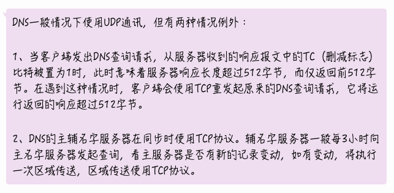
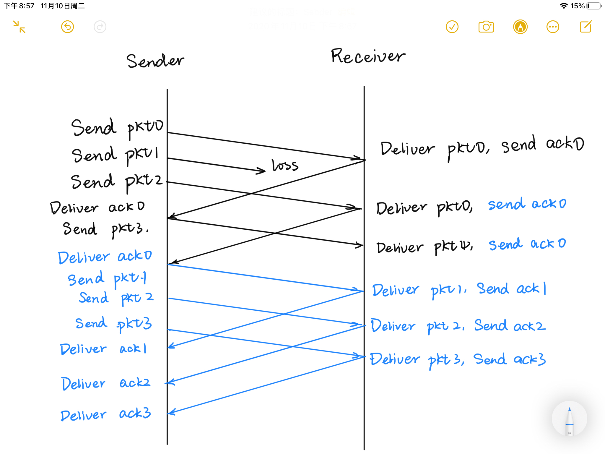
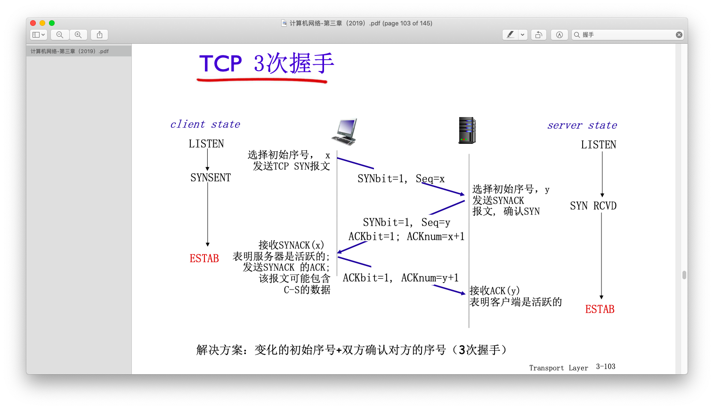

# 计网样卷答案不靠谱版

by OrigamiAyc at WinterFell

Nov.9th

## 单选题

| 1    | 2    | 3    | 4    | 5    | 6    | 7    | 8    | 9    | 10   |
| ---- | ---- | ---- | ---- | ---- | ---- | ---- | ---- | ---- | ---- |
| D    | A    | C    | A    | C    | C    | C    | B    | D    | D    |

1. 在不同的网络情况下这些延迟可能差距很大，甚至几个量级，所以最主要的延迟不是固定的
2. 网络核心中的设备只有最底层两层，即链路和物理
3. 同层通信，书上有图
4. A：百度出来的，有哪位hxd在树上or PPT上面找到了请issue；B：发件人用户代理 -> 发件人服务器 ->(SMTP，推协议) 收件人服务器 -> 收件人主动读取信箱；C：收件人这边是主动（“在方便的时间”）读取；D：SMTP直接发送
5. SMTP是服务器之间的通信，不管信箱的
6. A：可以不用域名，比如诚哥课的 GitLab（[http://222.195.68.197/](http://222.195.68.197/)）；B：如果服务器在多台主机上面，那就会有很多IP；C：根服务器、顶级域、权威服务器；D：可以缓存
7. 这题很神奇，按照第六版的说法，BCD都是错的：P88（2.5.1）“DNS协议运行在UDP之上“，以及P89最下面（2.5.2）“所有的DNS请求和回答报文使用UDP数据报经端口53发送“。🤣不过……助教说还是选A，因为
8. 略
9. 首先注意到一点：**主机B正确接受后**。这就意味着不能是重传的包（即不可能出现下图1的情况）。只有两种情况：pkt90之前都正常接受了，以及反之。如果正确接受就是回应ACK190，如果没有完全正确接受，由于累积确认，回应一个小于等于90的ACK（我画了好久的(｡ì _ í｡)
10. The term *socket* is also used for the software endpoint of node-internal [inter-process communication](https://en.wikipedia.org/wiki/Inter-process_communication) (IPC), which often uses the same API as a network socket. (From `Wikipedia`)（然鹅应用层不就疯狂暗示是精确到进程了么ówò

## 简答题

### 一、

### 二、

- 差错编码：差错编码提供了一种发现传输错误的机制
- 确认：确认提供了一种反馈机制，使得发送方可以得知接收方的接收情况
- 重传：重传提供了修正错误的方法，即用新的正确的包替换错误的
- 定时器：定时器提供了发现/定义超时的方法，避免死锁无限等待
- 分组序号：分组序号提供了区分不同分组的方式，流水线操作不会引起混乱

### 三、

1. 电路交换在通信时建立专属连接链路，而分组交换共享通信链路；电路交换连接一旦建立起来就可以保证性能，而分组交换会受到其他因素如网络拥塞程度等的影响
2. 由于大多数用户对链路的使用率很低，电路交换会浪费大量的资源。而分组交换可以支持很多用户以共享的方式同时使用，在用户使用率较低的时候可以满足更多用户的需求

### 四、

本题指的是 A->B, B->A, A->B 这三个报文，NULL代表没有这一项

| 报文段 | SYN flag | ACK flag | Seq Number | ACK Number |
| ------ | -------- | -------- | ---------- | ---------- |
| 1      | 1        | 0        | 9          | NULL       |
| 2      | 1        | 1        | 38         | 10         |
| 3      | 0        | 1        | NULL       | 39         |

### 五、

不正确。

TCP协议一定是端对端的，是两台主机之间的通讯协议。

web服务器可以在端口80上面为大量客户提供服务的原因是，TCP是以（源IP，源端口号，目标IP，目标端口号）这个四元组为唯一标识符的，它会根据这个标识符为每一个client创立自己的专属socket来维持连接（这块我不知道这么说对不对）

### 六、

这块我也不太确定

- 确认已收到的报文段：TCP采取“累积确认”的策略，当收到编号为k的ACK时，表示编号≤k的段都已经正确收到
- 检测丢失的报文段：若重复收到3个同样编号的ACK，那么就是丢失了，需要重传
- 调整超时定时器的设置：当收到编号为k的ACK时，若k大于当前正在启动定时器的分组编号，那么就更新已被确认的报文段序号，并重启定时器
- 流量控制：接收方在其向发送方的TCP段头部的rwnd字段通告其空闲buffer大小
- 拥塞控制：端系统根据延迟和丢失事件判断是否有拥塞

## 计算题

### 一、

取 `.html` 也需要一次TCP连接。TCP握手的第三次报文可以附加在请求数据的报文上面

#### 非持久HTTP

包括 `.html` 共有 n+1 个对象，每一次都是建立TCP连接以及请求数据两个RTT

$2RTT\times(n+1)=2n+2\ RTT$

#### 非流水线持久HTTP

请求 `.html` 需要两个RTT，请求n个图片需要一次TCP连接RTT和n次请求对象

$2RTT+(n+1)RTT=n+3\ RTT$

#### 流水线持久HTTP

请求 `.html` 需要两个RTT，请求n个图片需要一次TCP连接RTT，由于发送时间忽略，故n个图片在一个RTT内流水完成

$2RTT+2RTT=4RTT$

### 二、

1. 门限为8或者9，因为从表中数据可以看出，增长到8之后下一次增长到9，这说明门限为8（恰好达到门限）或者为9（门限小于下一次指数增长后的值，且下一次达到这个门限）**Anyway**，郑烇老师说，没必要考虑这么复杂……
2. [1, 4]、[9, 10]。指数增长的部分是慢启动。
3. [5, 6]、[7, 8]、[11, 12]。线性增长的部分是拥塞避免阶段
4. 6：收到3个相同的ACK；8：超时。第6轮时出现了窗口门限减半，故是收到了3个相同的ACK；第8轮出现了拥塞窗口门限减为1，故为超时

### 三、

$\frac{50000}{10^7}=0.005s=5ms$

#### 停等协议

$$
\frac{5}{5+2\times250}=\frac 5{505}
$$

#### 滑动窗口协议

$$
\frac{5\times10}{5\times10+2\times250}=\frac {50}{550}
$$

#### 选取窗口大小

设欲选取的窗口大小为n

则最充分利用的情况是发送分组恰好充满整个传播时间，即
$$
5n=2\times250\\
n=100
$$
